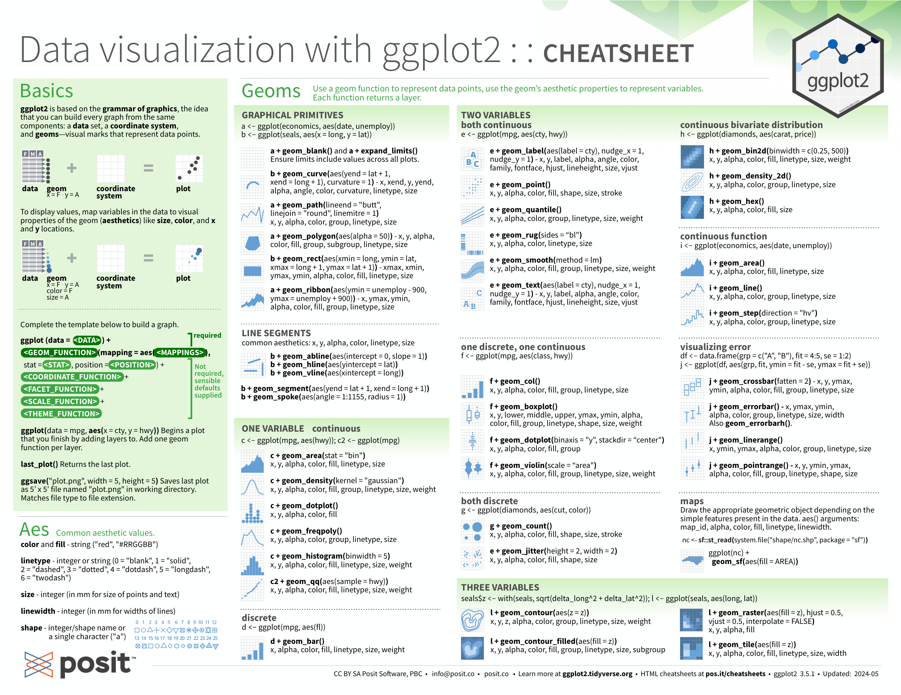
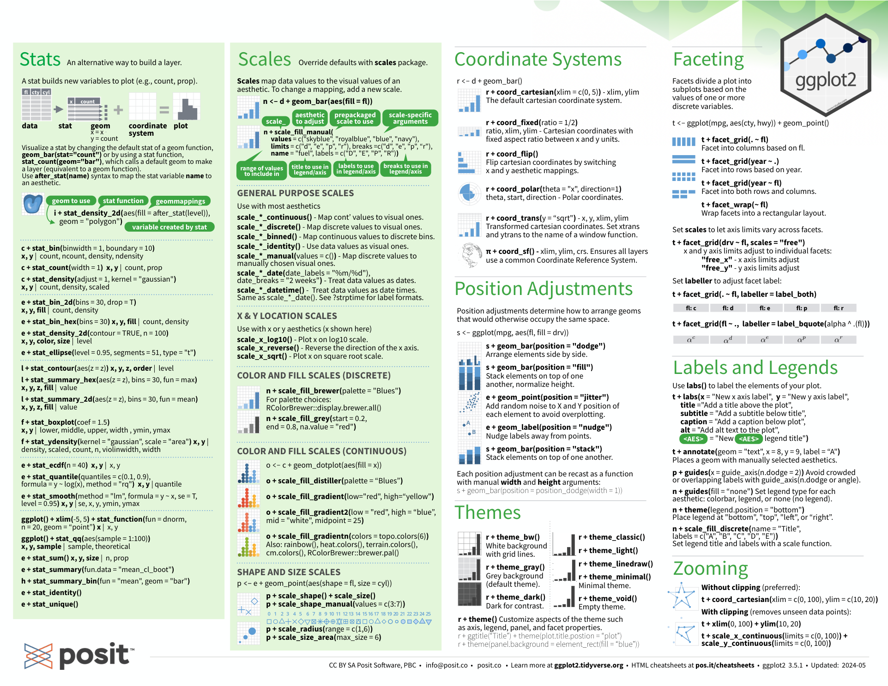

> “The greatest value of a picture is when it forces us to notice what we never expected to see.” -- John W. Tukey

Tools for data visualization: 

| scene                     | Package                 |
| ------------------------- | ---------------------- |
| basics data visualization ggplot2, lattice, grid ,  |
| interactive plots         | plotly, Sh              |
| more advanced challenges  | D                       |

## 7. Visualizing data distributions
- **Variable types**: categorical (ordinal or not) and numeric (discrete or continuous)
	- discrete numeric data can be considered ordinal
- **Distributions**: 
	1. empirical cumulative distribution function (eCDF)
	2. histograms
	3. smooth density plots: make it easier to compare two distributions
	4. normal distribution: use mean and standard deviation to describe the distribution.
- **Boxplots**: provides a five-number summary composed of the range (the minimum and maximum) along with the quartiles (the 25th, 50th, and 75th percentiles)
-  **stratification**: Dividing observations into groups based on the values of one or more variables associated with those observations. 
	- the resulting groups is _strata_.

## 8. ggplot2
- benifit: easy for beginners; more intuitive for beginners (it uses a grammar of graphics)
- limitation: work exclusively with data tables in tidy format.
- **ggplot2** consists of some components
	1. **Data**
	2. **Geometry**
	3. **Aesthetic mapping**

> DATA |> ggplot() + LAYER 1 + LAYER 2 + … + LAYER N

- **Packages**: **ggplot2**, **ggthemes**, **ggrepel**
- some functions in **ggplot2**: 
	- barplots: `geom_bar`
	-  histograms: `geo_histogram`
	- density plots: `geo_density`
	- boxplots: `geo_boxplot`
	- images: `geom_tile` and `geom_raster`

[ggplot2 cheatsheet pdf](./asset/data-visualization.pdf)


```R
library(ggthemes)
library(ggrepel)

r <- murders |> 
  summarize(rate = sum(total) /  sum(population) * 10^6) |>
  pull(rate)

murders |> 
  ggplot(aes(population/10^6, total)) +   
  geom_abline(intercept = log10(r), lty = 2, color = "darkgrey") +
  geom_point(aes(col = region), size = 3) +
  geom_text_repel(aes(label = abb)) + 
  scale_x_log10() +
  scale_y_log10() +
  labs(title = "US Gun Murders in 2010",
                x = "Populations in millions (log scale)", 
                y = "Total number of murders (log scale)",
                color = "Region") +
  theme_economist()
```

