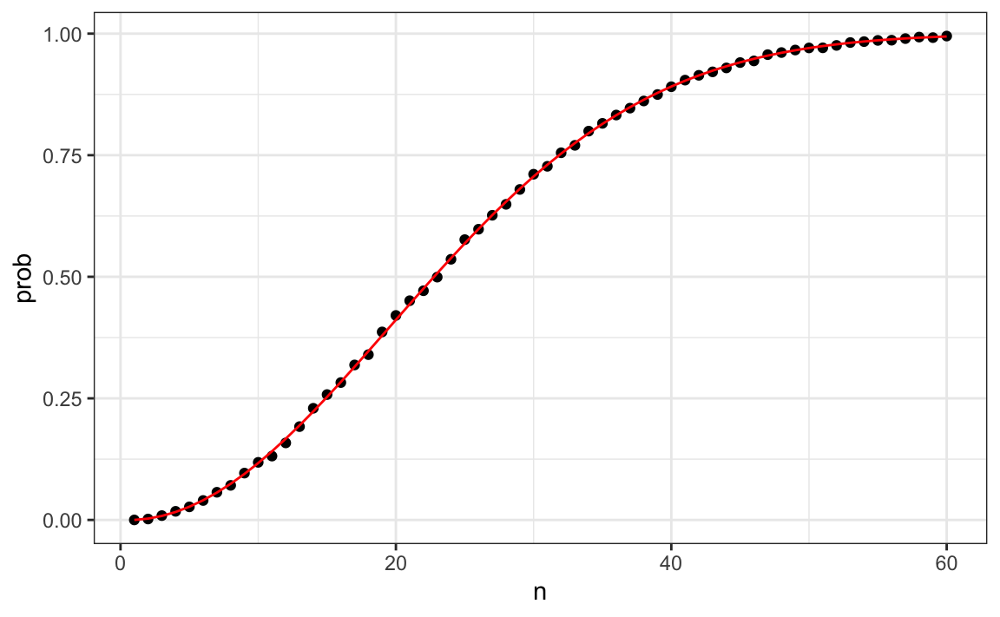

# Probability

This part discusses concepts of probability, and uses R to demonstrate these concepts.

## 1. Discrete probability

**The most important thing in this chapter is to learn how to calculate probabilities and use Monte Carlo simulations.**

**Event**: refer to things that can happen when something occurs by chance.

**Distribution**: We simply assign a probability to each category. their proportion defines the distribution.

**Monte Carlo**

```r
# Setting the random seed
set.seed(1986)
# rep to generate the
beads <- rep(c("red", "blue"), times = c(2,3))
B <- 10000
# repeat the same task any number of times.
events <- replicate(B, sample(beads, 1))
# use table to see the distribution
tab <- table(events)
# prop.table gives the proportions
prop.table(tab)

events <- sample(beads, B, replace = TRUE)
```

**Seed**: A popular way to pick the seed is the year - month - day

`sample` selects elements _without replacement_ by default. We can change the `replace` argument to `replace=TRUE` for selects elements _with replacement_

**Independent**: two events are independent if the outcome of one does not affect the other

**Multiplication rule**:

$$
\mbox{Pr}(A \mbox{ and } B) = \mbox{Pr}(A)\mbox{Pr}(B \mid A)
$$

**Addition rule**:

$$
\mbox{Pr}(A \mbox{ or } B) = \mbox{Pr}(A) + \mbox{Pr}(B) - \mbox{Pr}(A \mbox{ and } B)
$$

**Combinations and permutations**: `combinations` and `permutations` in library `gtools`

### Example

#### 1. _Natural 21_ in Blackjack

Two ways to estimate the probablity:
1. Caculate directly

```r
library(gtools)

suits <- c("Diamonds", "Clubs", "Hearts", "Spades")
numbers <- c("Ace", "Deuce", "Three", "Four", "Five", "Six", "Seven", 
             "Eight", "Nine", "Ten", "Jack", "Queen", "King")
deck <- expand.grid(number = numbers, suit = suits)
deck <- paste(deck$number, deck$suit)

hands <- permutations(52, 2, v = deck)
first_card <- hands[,1]
second_card <- hands[,2]

aces <- paste("Ace", suits)

facecard <- c("King", "Queen", "Jack", "Ten")
facecard <- expand.grid(number = facecard, suit = suits)
facecard <- paste(facecard$number, facecard$suit)

hands <- combinations(52, 2, v = deck)
mean(hands[,1] %in% aces & hands[,2] %in% facecard)
```

2. Monte Carlo simulation

```r
hand <- sample(deck, 2) 

blackjack <- function(){
   hand <- sample(deck, 2)
  (hand[1] %in% aces & hand[2] %in% facecard) | 
    (hand[2] %in% aces & hand[1] %in% facecard)
}

B <- 10000
results <- replicate(B, blackjack())
mean(results)
```

#### 2. Monty Hall problem

```r
B <- 10000
monty_hall <- function(strategy){
  doors <- as.character(1:3)
  prize <- sample(c("car", "goat", "goat"))
  prize_door <- doors[prize == "car"]
  my_pick  <- sample(doors, 1)
  show <- sample(doors[!doors %in% c(my_pick, prize_door)],1)
  stick <- my_pick
  stick == prize_door
  switch <- doors[!doors %in% c(my_pick, show)]
  choice <- ifelse(strategy == "stick", stick, switch)
  choice == prize_door
}
stick <- replicate(B, monty_hall("stick"))
mean(stick)
#> [1] 0.342
switch <- replicate(B, monty_hall("switch"))
mean(switch)
#> [1] 0.668
```

#### 3. Birthday problem

Monte Carlo simulation

```r
B <- 10000

same_birthday <- function(n){
  bdays <- sample(1:365, n, replace = TRUE)
  any(duplicated(bdays))
}

compute_prob <- function(n, B = 10000){
  results <- replicate(B, same_birthday(n))
  mean(results)
}

n <- seq(1,60)
prob <- sapply(n, compute_prob)
```

Real probability

$$
1 \times \frac{364}{365}\times\frac{363}{365} \dots \frac{365-n + 1}{365}
$$

```r
exact_prob <- function(n){
  prob_unique <- seq(365, 365 - n + 1)/365 
  1 - prod( prob_unique)
}
eprob <- sapply(n, exact_prob)
qplot(n, prob) + geom_line(aes(n, eprob), col = "red")
```



 the larger the B, the better the approximation How to determine the B?

- One practical approach is to check for the stability of the estimate.

## 2. Continuous probability

In this chapter, we should know the concept of: _Cumulative distribution functions_, _Probability density function_

R uses a convention that lets us remember the names, namely using the letters `d` (density function), `q` (quantile function), `p` (distribution function), and `r` (random generation) in front of a shorthand for the distribution. (e.g. `dnorm`, `qnorm`, `pnorm`, `rnorm`)

A simple chapter~

## 3. Random variables

**Central Limit Theorem**: when the number of draws, also called the _sample size_, is large, the probability distribution of the sum of the independent draws is approximately normal.

_Using the CLT, we can skip the Monte Carlo simulation_

**Law of large numbers**: the standard error of the average becomes smaller and smaller as sample size grows larger.